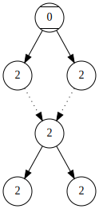

# Bracket

[](https://github.com/max-co/bracket/blob/main/LICENSE)

Bracket Rabin (tree) Automata Checker of (non-)Emptiness Tool is a simple program for checking if a sufficiently small Rabin infinite tree automaton admits a successful run.

Bracket makes use of:
- [The Compiler Generator Coco/R](https://ssw.jku.at/Research/Projects/Coco/) released under the [GNU General Public License version 2](https://www.gnu.org/licenses/old-licenses/gpl-2.0.txt) or later (only for the build process)
- [The Boost C++ libraries](https://www.boost.org/) released under the [Boost Software License](https://www.boost.org/LICENSE_1_0.txt)

These dependencies are not distributed together with Bracket.
For simplicity the GNU Make Makefile responsible for the build tries to download them using [cURL](https://curl.se/) or alternatively they can be downloaded manually from their respective websites.

# Usage

```console
usage: bracket [options] [input file]
  if no input file is specified the input is read from the standard input

options:

  -g  : Possibly output a Graphviz representation of a found successful run
        to a file (default file: run.gv)

  -h  : Print this help message and exit

  -i <file> : Set <file> as the input file

  -l  : Output a logic programming representation of the automaton and possibly
        of a found successful run to a file (default file: automaton.lp)

  -o <file> : Set <file> as the output file for the -g option and also
              implicitly activate option -g

  -t <num>  : Set <num> (>= 1) as the maximun number of concurrent threads
              (default: 1)

  -w  : Overwite the content of output files that already exist

  -L <file> : Set <file> as the output file for the -l option and also
              implicitly activate option -l

  -V : Print version information and exit
```

## Input

Bracket takes in input an input-free Rabin automaton encoded as follows:

```
# this is a comment

states := 3

# sets 0 as the starting state
start := 0

# u > v w encodes that (u,_,v,w) belongs to the transition relation
transitions := 0 > 1 1, 0 > 2 2, 1 > 1 1, 1 > 2 2
	2 > 1 1, 2 > 2 2

# L = {1}, U = {0,1,2}
acceptances := (1, 0 1 2)
```

The number of states is specified with the **states** attribute and each state is identified by an integer from 0 to **states**-1.
The acceptance conditions are specified in a list of couples (*L*, *U*) where *L* and *U* are sets of states.
The set of states can be constructed starting from the state numbers which represent the corresponding singleton, and the keywords **none** and **all** which indicate respectively the empty set and the set {0,1,2,..,**states**-1}.
More complex sets can be constructed using the negation (**^**), intersection (**&**) and union (**[whitespace]**) operators and possibly supplementary parentheses.

## Output

If the language of the automaton is empty Bracket writes **EMPTY LANGUAGE** on the standard output or alternatively **NONEMPTY LANGUAGE** is written if the automaton has an accepted run.

If the **-g** or **-o** options are supplied and an infinite successful run is found then Bracket provides in output a finite [Graphviz](https://graphviz.org/) representation of the found run.



This is the representation of the successful run found by Bracket for the automaton of the Input section.
Each run node is labelled with its associated state and the edges of the run are represented by directed solid edges.
The dotted edges have a different meaning and are called graft edges.
If *u* --> *v* is a graft edge then when *u* is reached the run behaves as if it was on *v*, in particular the states of the next nodes of the run are those of the children of *v*.
When a node *w* with no outgoing edges is reached then the run behaves as the (lowest) ancestor of *w* in the run that has the same state of *w*.
In this example each path of the found run is of the type 0,1,2,2,2,2,2,...

**NOTE** that the runs found by Bracket have no additional properties (like compactness) apart from being accepted and that if Bracket is executed with multiple threads by using the **-t** option then the output runs may differ between different invocations.

# Build

## Portability

The source code is conforming to POSIX.1-2008 so the source files should be compilable on the POSIX.1-2008 compliant platforms which are supported by the Boost libraries.

## Build

**Requirements:**
- gcc
- GNU Make >= 4.2.1 (older versions may also work)
- curl, tar, unzip (for downloading Coco/R and the Boost libraries)

To build the **bracket** executable it is sufficient to execute the command:
```sh
make
```
in the base directory.

## Tests

**Additional Requirements:** [clingo](https://potassco.org/clingo/) >= 4.2.0

To execute the tests either execute:
```sh
make tests
```
 in the base directory or simply:
```sh
make
```
in the **tests** directory.

## Benchmarks

**Additional Requirements:** time, shuf, seq, Python 3 with matplotlib

Executing:
```sh
make benchmarks
```
in the **tests** directory runs some benchmarks and displays a simple line chart of the results.

## THREADS variable

The Makefiles have a **THREADS** variable used to specify the value of the **-t** option for each invocation of Bracket.
For example with the command:
```sh
make THREADS=4
```
the option **-t 4** will be passed to Bracket by GNU Make.

# Appendix

## Auxiliary utilities

The **tests** directory contains some additional utilities developed for the testing of Bracket:
- **random_automaton:** a cli utility that accepts some arguments and generates a parametrized random Rabin automaton in the syntax accepted by Bracket
- **find.lp:** an Answer Set Programming program for checking the emptiness of very small Rabin automata
- **check.lp:** an Answer Set Programming program for checking if a run found by Bracket is effectively accepted by the automaton
- **diagrams.py:** a trivial Python 3 script for plotting the results of the benchmarks
